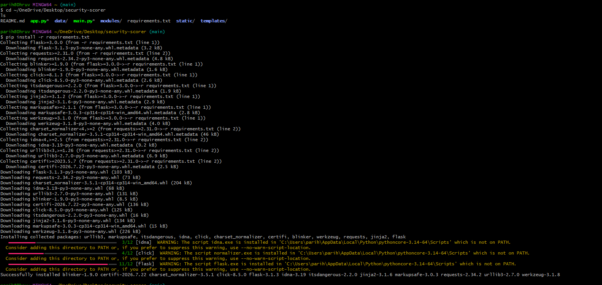
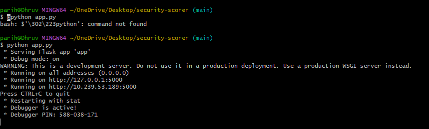

# Setup & Installation

## Requirements
- Python 3.8+
- `nmap` installed and on PATH (`sudo apt install nmap` on Parrot/Kali)
- pip packages: `flask`, `requests` (installed via requirements.txt)

## Installation

```bash
git clone https://github.com/Dhruv-parihar/security-scorer.git
cd security-scorer
pip install -r requirements.txt --break-system-packages
```

## Running the CLI

```bash
python3 main.py
```

## Running the Flask Web UI

```bash
python3 app.py
```

Then open `http://127.0.0.1:5000` in a browser.

## Screenshots

| | |
|---|---|
|  | Installing dependencies via `pip install -r requirements.txt` |
|  | Flask development server running on port 5000 |
