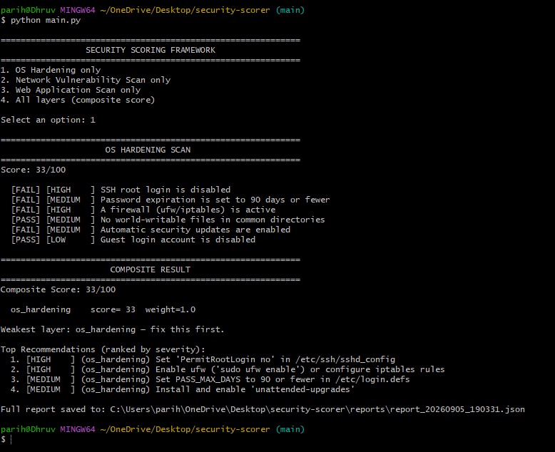
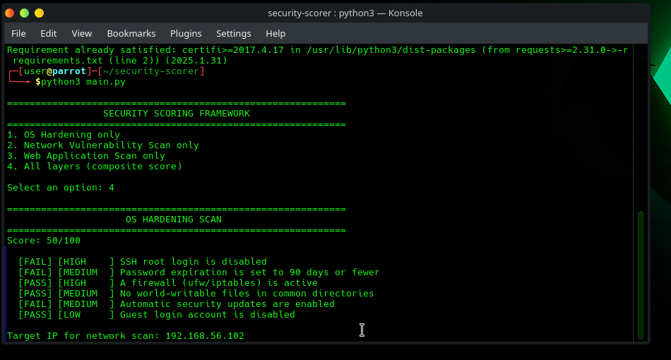
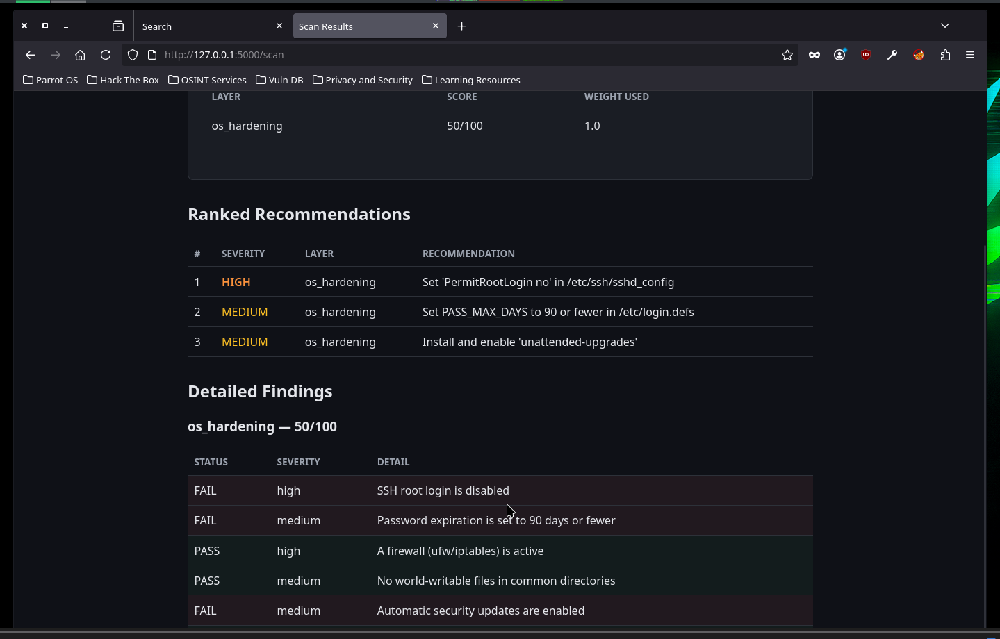

# OS Hardening Scan

## What it checks
The OS hardening module runs 6 local configuration checks against the
host machine, inspired by CIS Benchmark categories:

| Check | Severity |
|-------|----------|
| SSH root login disabled | High |
| Password expiration ≤ 90 days | Medium |
| Firewall (ufw/iptables) active | High |
| No world-writable files | Medium |
| Automatic security updates enabled | Medium |
| Guest login account disabled | Low |

Each check returns PASS/FAIL with a specific remediation recommendation.
The score is the proportion of checks passed, weighted by severity.

## Usage (CLI)

```bash
python3 main.py
# Select option 1
```

## Results

### Windows host (baseline — unconfigured system)
Score: **33/100** — typical for a default Windows/developer machine
with no specific hardening applied.

### Parrot OS (attack machine)
Score: **50/100** — better baseline since Parrot ships with a firewall
active and guest login disabled by default, but still missing SSH
hardening and automatic updates.

## Screenshots

| | |
|---|---|
|  | CLI output: OS hardening scan on Windows host — score 33/100 |
|  | CLI output: OS hardening scan on Parrot OS — score 50/100 |
|  | Web UI showing OS hardening results with ranked recommendations |
