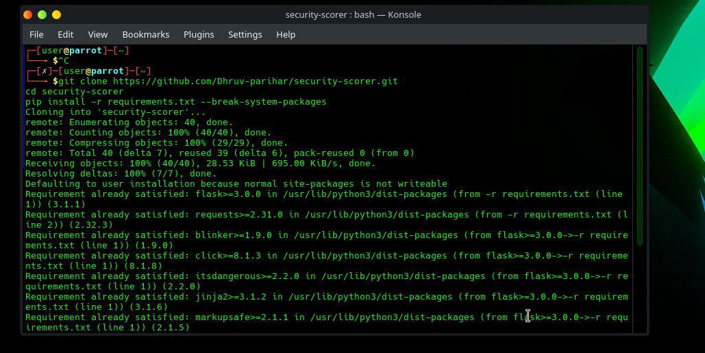
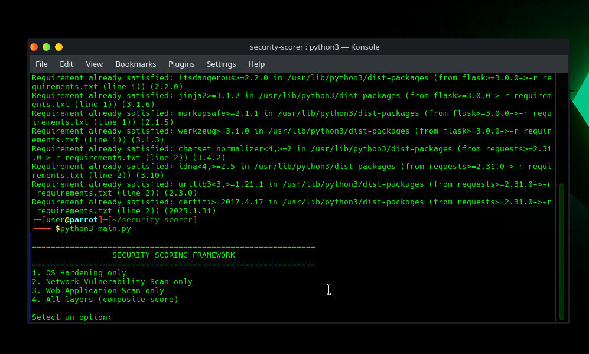
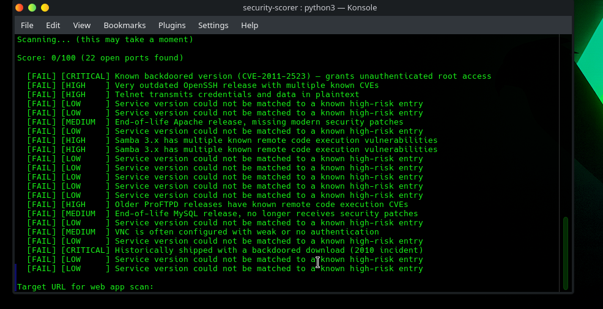
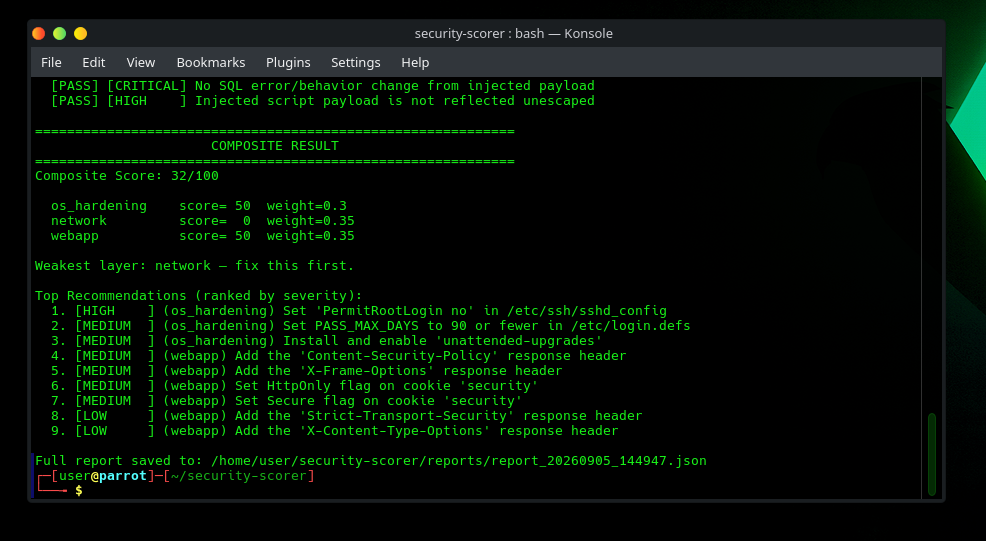

# Full Composite Scan

## What it does
Runs all three layers (OS Hardening, Network, Web Application) and
combines them into a single weighted composite score with a ranked,
cross-layer recommendation list.

**Default weights:**
- OS Hardening: 30%
- Network: 35%
- Web Application: 35%

Weights are re-normalized if only some layers are selected.

## Usage (CLI)

```bash
python3 main.py
# Select option 4
# Target IP: 192.168.56.102
# Target URL: http://192.168.56.102/dvwa/vulnerabilities/sqli/?id=1
```

## Results against Metasploitable 2 lab

| Layer | Score | Weight |
|-------|-------|--------|
| OS Hardening | 50/100 | 0.30 |
| Network | 0/100 | 0.35 |
| Web Application | 50/100 | 0.35 |
| **Composite** | **32/100** | — |

**Weakest layer: Network** — fix this first.

The composite scoring correctly identified the network layer as the
highest-priority concern, consistent with the manual exploitation
findings in the companion pentest lab repo, where the vsftpd 2.3.4
backdoor granted unauthenticated root access in a single Metasploit
command.

## Ranked recommendations (top 5)

| # | Severity | Layer | Recommendation |
|---|----------|-------|----------------|
| 1 | HIGH | os_hardening | Set PermitRootLogin no in /etc/ssh/sshd_config |
| 2 | MEDIUM | os_hardening | Set PASS_MAX_DAYS to 90 or fewer |
| 3 | MEDIUM | os_hardening | Install and enable unattended-upgrades |
| 4 | MEDIUM | webapp | Add Content-Security-Policy response header |
| 5 | MEDIUM | webapp | Add X-Frame-Options response header |

## Screenshots

| | |
|---|---|
|  | Cloning the repo and installing dependencies on Parrot OS |
|  | CLI menu launched on Parrot OS, selecting option 4 (all layers) |
|  | OS hardening layer result on Parrot (50/100) |
|  | Network scan against Metasploitable — 22 open ports, 2 critical findings |
|  | Final composite score (32/100) with ranked cross-layer recommendations |
