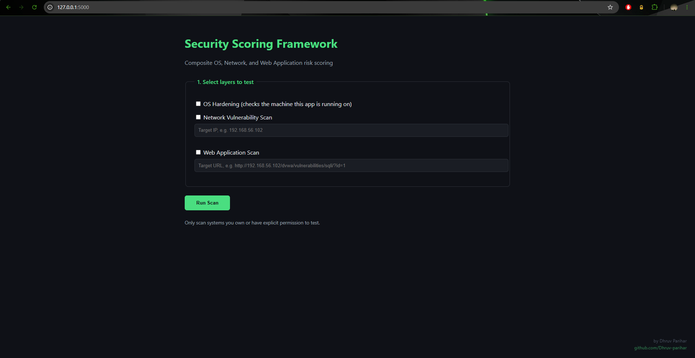
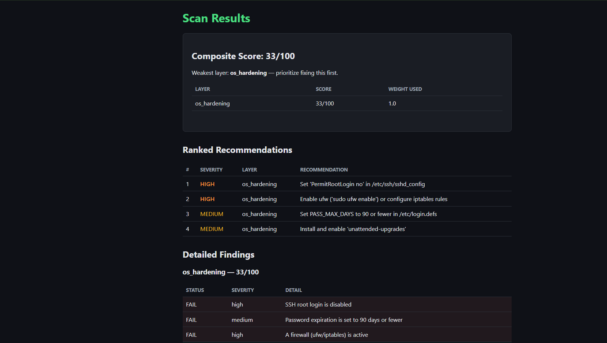
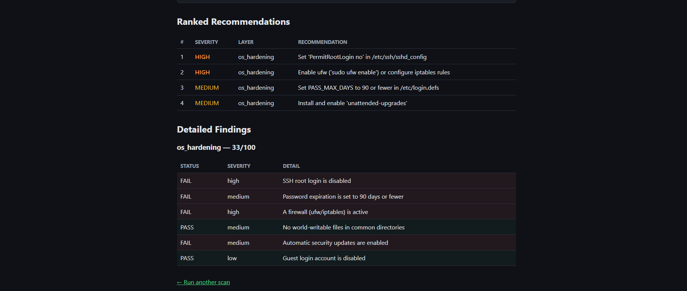
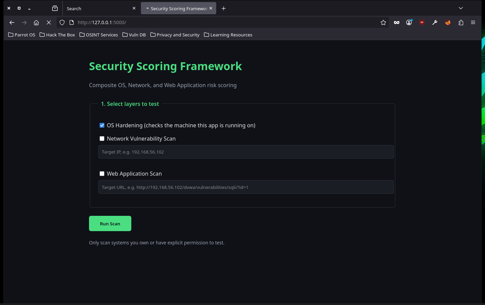
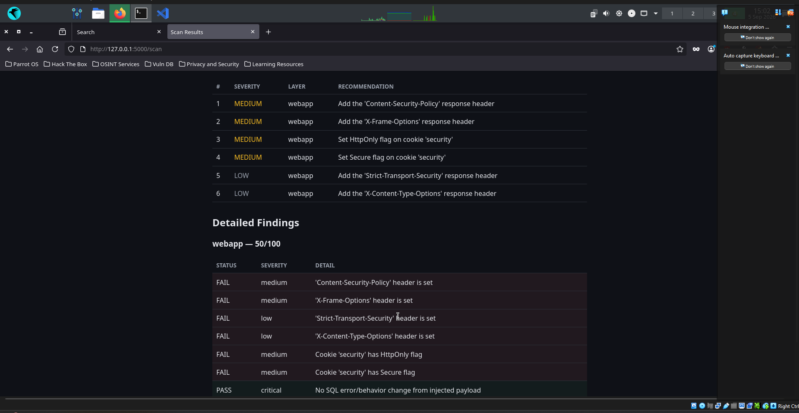

# Flask Web UI

## Overview
The same scanning engine as the CLI, wrapped in a clean dark-themed
web interface with layer selection, a composite score dashboard, and
a ranked recommendation table with color-coded severity.

## Running

```bash
python3 app.py
# Open http://127.0.0.1:5000
```

## Features
- Checkbox-based layer selection (OS / Network / Web App or all three)
- Target IP and URL inputs for network and web app scans
- Composite score with weakest-layer callout
- Ranked recommendations table (critical → high → medium → low)
- Detailed per-layer findings with PASS/FAIL status
- Author watermark (bottom-right: "by Dhruv Parihar / github.com/Dhruv-parihar")

## Screenshots

| | |
|---|---|
|  | Main scan form on Windows host — watermark visible bottom-right |
|  | Results page: OS hardening scan on Windows (33/100) with ranked recommendations |
|  | Detailed findings table with PASS/FAIL per check |
|  | Web UI running inside Parrot OS, OS hardening selected |
|  | OS hardening results on Parrot (50/100) |
|  | Web app scan results against DVWA — missing headers, cookie flags |
